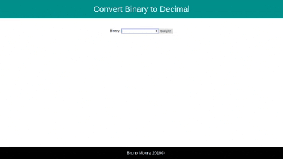

A NodeJS Application that converts a binary number into a decimal one.

# Convert Binary to Decimal



## Why

This project was created for my personal portifolio, so if you could let me any feedback I'd appreciate so much. Any comment that can make me a better programmer will be help a lot!

And for sure, you can use this Project as you wish!

It's free!

## Contact info

My [LinkedIn](https://www.linkedin.com/in/brunomoura1/)

My email bruno8moura@gmail.com

## Getting started

### Installing

```
$ git clone git@github.com:brunocmoura/binary-to-decimal.git
$ cd binary-to-decimal
$ npm install
```

### Running application

```
$ node server.js
```

## Build with

 - [ExpressJS](https://expressjs.com/) - Framework that acts like abstraction layer in order to facilitate development. 
 - [body-parser](https://www.npmjs.com/package/body-parser/) - An ExpressJS module that deal with(validate and do the parse) the requests are incoming at NodeJS.
 - [Marko](https://markojs.com/) - A friendly and super fast UI library that makes building web apps fun.
